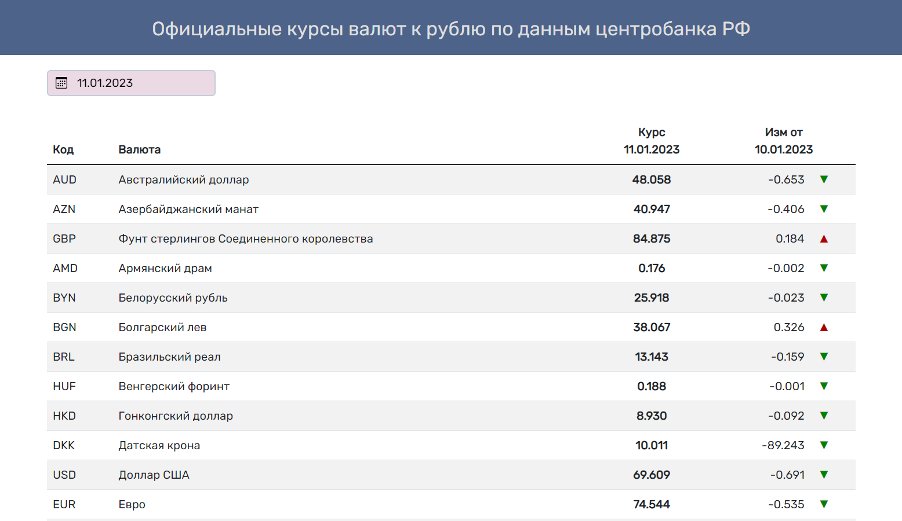
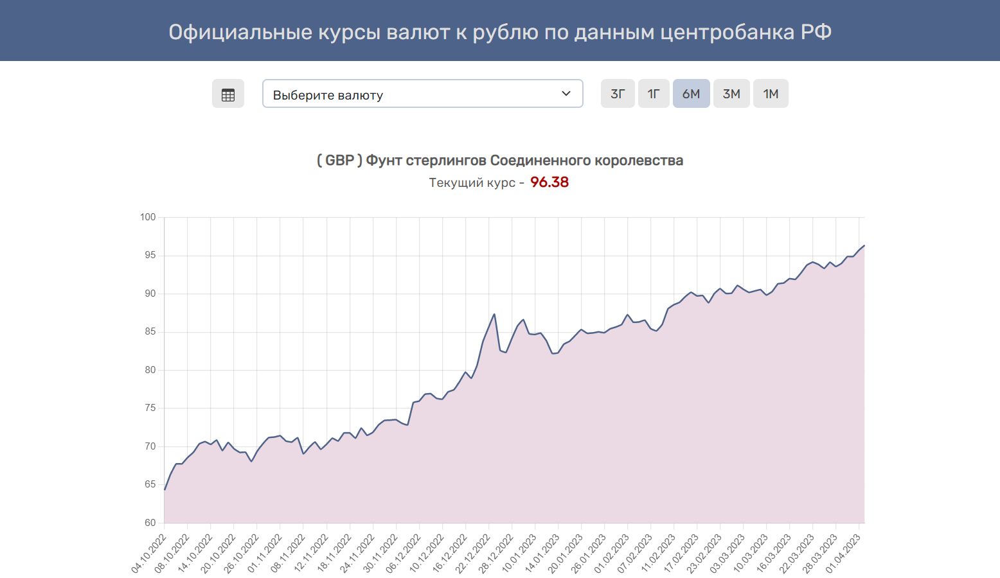

<h1 align="center">
<a href="https://repti58.github.io/Currency-rates">
Currency rates
</a>
</h1>

https://repti58.github.io/Currency-rates

<h3>This web app using backend deployed on Vercell.com</h3>

**Github (backend):**  https://github.com/repti58/Currency-rates-backend.git

## Contains:
- **Data on exchange rates for any date**
- **Rates change display (amount and pointer indicator)**
- **Chart for different periods (month, 3 month, 6 month, year, 3 year)**

## Features:
- **Adaptive layout**
- **Technologies used: HTML, CSS, Bootstrap, JavaScript, React, Redux/Redux-toolkit, Axios**

## Appearance:

